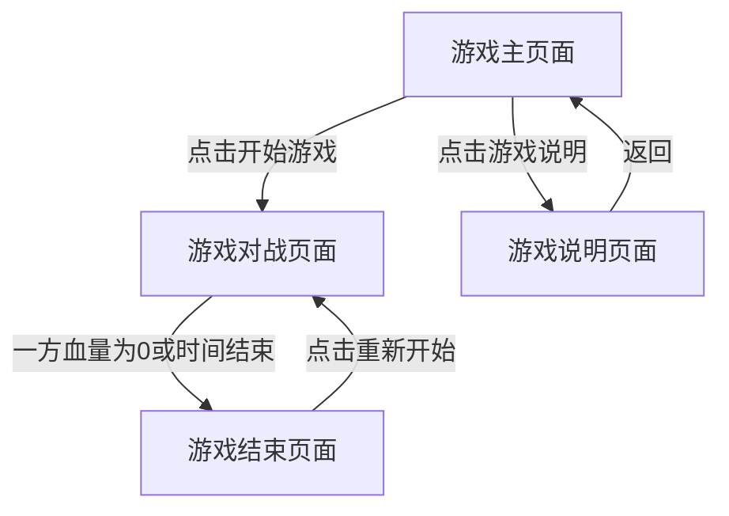

## 1. Product Overview
像素风机甲对战小游戏，玩家控制机甲进行对战，体验复古像素风格的战斗乐趣。
- 提供简单直观的游戏体验，适合休闲玩家快速上手
- 复古像素风格设计，唤起怀旧游戏情感，目标用户为喜欢怀旧游戏的玩家

## 2. Core Features

### 2.1 User Roles
| Role | Registration Method | Core Permissions |
|------|---------------------|------------------|
| Player | 无需注册 | 控制机甲进行对战 |

### 2.2 Feature Module
1. **游戏主页面**：开始游戏按钮，游戏说明
2. **游戏对战页面**：机甲对战场景，操作控制，游戏状态显示
3. **游戏结束页面**：显示胜负结果，重新开始按钮

### 2.3 Page Details
| Page Name | Module Name | Feature description |
|-----------|-------------|---------------------|
| 游戏主页面 | 开始游戏按钮 | 点击后进入游戏对战页面 |
| 游戏主页面 | 游戏说明 | 显示游戏操作说明和规则 |
| 游戏对战页面 | 机甲角色 | 两个像素风格机甲，支持移动、攻击、防御操作 |
| 游戏对战页面 | 操作控制 | 键盘控制机甲1：WASD移动，J攻击，K防御；键盘控制机甲2：方向键移动，1攻击，2防御 |
| 游戏对战页面 | 游戏状态显示 | 显示双方机甲血量，游戏时间 |
| 游戏结束页面 | 胜负结果 | 显示获胜方，游戏结束动画 |
| 游戏结束页面 | 重新开始按钮 | 点击后重新开始游戏 |

## 3. Core Process
玩家进入游戏主页面 → 点击开始游戏 → 进入游戏对战页面 → 控制机甲进行对战 → 一方血量为0或时间结束 → 进入游戏结束页面 → 显示胜负结果 → 点击重新开始按钮 → 回到游戏对战页面

## 4. User Interface Design
### 4.1 Design Style
- 主色调：深灰色(#333333)背景，亮色边框(#FFFFFF)，红色(#FF0000)和蓝色(#0000FF)分别代表两个机甲
- 按钮风格：像素风格，3D效果，有按压反馈
- 字体：像素风格字体，如Press Start 2P
- 布局风格：居中布局，游戏区域占主要位置，UI元素分布在四周
- 图标风格：像素风格，简洁明了

### 4.2 Page Design Overview
| Page Name | Module Name | UI Elements |
|-----------|-------------|-------------|
| 游戏主页面 | 开始游戏按钮 | 像素风格按钮，绿色(#00FF00)，悬停时放大效果 |
| 游戏主页面 | 游戏说明 | 像素风格文本，白色字体，黑色背景框 |
| 游戏对战页面 | 机甲角色 | 像素风格机甲，红色和蓝色，有移动、攻击、防御动画 |
| 游戏对战页面 | 操作控制 | 屏幕底部显示按键提示，像素风格图标 |
| 游戏对战页面 | 游戏状态显示 | 屏幕顶部显示双方血量条，红色和蓝色，数字显示剩余血量 |
| 游戏结束页面 | 胜负结果 | 大屏幕显示"Player 1 Wins!"或"Player 2 Wins!"，像素风格文本，对应颜色 |
| 游戏结束页面 | 重新开始按钮 | 像素风格按钮，黄色(#FFFF00)，悬停时放大效果 |

### 4.3 Responsiveness
- 桌面优先设计，支持键盘操作
- 响应式布局，在不同屏幕尺寸下保持游戏区域比例
- 触摸优化：在移动设备上显示虚拟按键

### 4.4 3D Scene Guidance
- 游戏采用2D像素风格，无3D场景