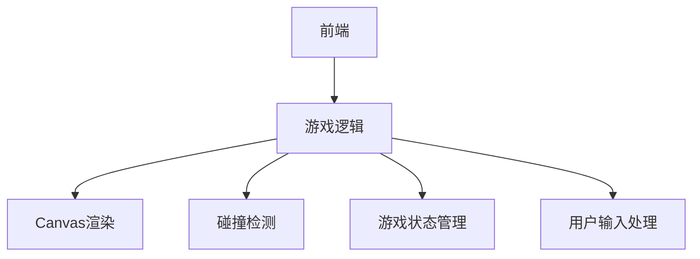
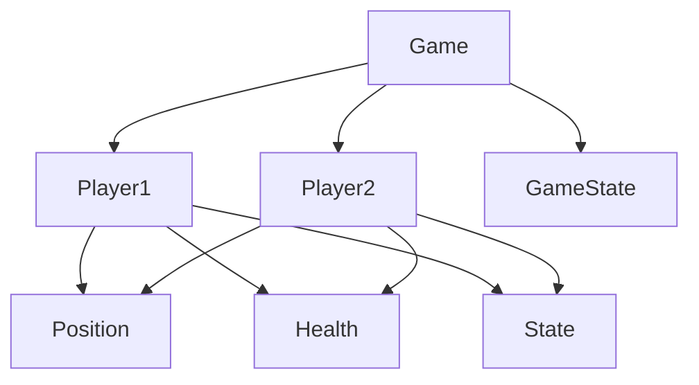

## 1. Architecture Design

## 2. Technology Description
- 前端：HTML5 + CSS3 + JavaScript
- 渲染技术：HTML5 Canvas
- 字体：Google Fonts - Press Start 2P
- 音频：Web Audio API (可选)
- 无后端需求

## 3. Route Definitions
| Route | Purpose |
|-------|---------|
| / | 游戏主页面 |

## 4. API Definitions
- 无API需求，游戏完全在前端运行

## 5. Server Architecture Diagram
- 无后端需求

## 6. Data Model
### 6.1 Data Model Definition

### 6.2 Data Definition Language
- 无数据库需求，游戏状态存储在内存中