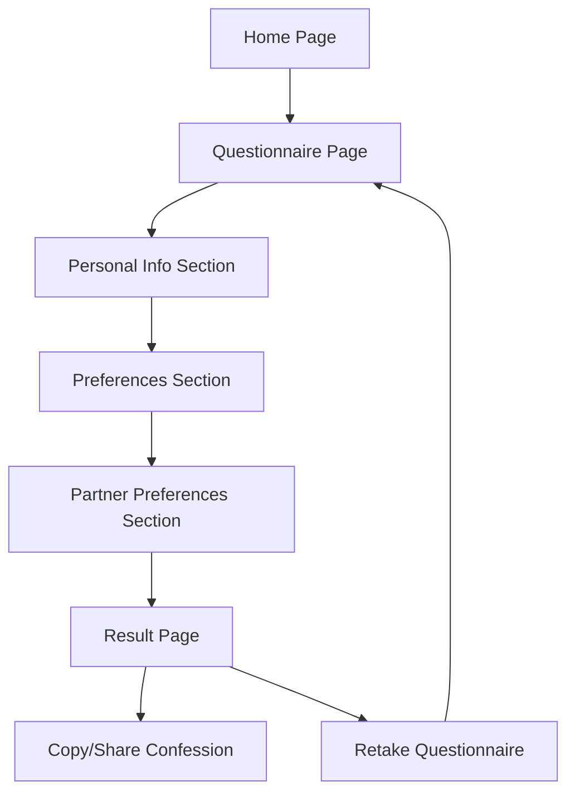

## 1. Product Overview
表白自动生成小程序，专为内向腼腆的技术人员设计，通过有趣的问卷生成定制化表白话语。
- 解决技术人员在表白时的语言表达障碍，提供个性化、有趣的表白内容
- 目标用户为技术背景的年轻人，市场价值在于满足情感表达需求

## 2. Core Features

### 2.1 User Roles
| Role | Registration Method | Core Permissions |
|------|---------------------|------------------|
| Normal User | No registration required | Use all features, generate and share confession messages |

### 2.2 Feature Module
1. **Home page**: hero section, start button, about section
2. **Questionnaire page**: personal info collection, preferences questionnaire, partner preferences questionnaire
3. **Result page**: personalized confession message, share options, retry button

### 2.3 Page Details
| Page Name | Module Name | Feature description |
|-----------|-------------|---------------------|
| Home page | Hero section | Eye-catching design with title, brief description, and prominent start button |
| Home page | About section | Brief introduction of the app's purpose and how it works |
| Questionnaire page | Personal info | Collect gender, name, relationship status |
| Questionnaire page | Preferences | Collect personal preferences and personality traits |
| Questionnaire page | Partner preferences | Collect ideal partner traits and preferences |
| Result page | Confession message | Generate personalized, humorous confession based on questionnaire answers |
| Result page | Share options | Copy to clipboard, share via social media |
| Result page | Retry button | Allow user to go back and retake the questionnaire |

## 3. Core Process
1. User visits the website and sees the home page
2. User clicks "Start" button to begin the questionnaire
3. User completes personal information section (gender, name)
4. User answers personality and preference questions
5. User answers partner preference questions
6. System generates personalized confession message
7. User reviews the confession message
8. User copies or shares the confession message
9. User can choose to retake the questionnaire for different results

## 4. User Interface Design
### 4.1 Design Style
- Primary color: #FF6B6B (warm red for love theme)
- Secondary color: #4ECDC4 (teal for contrast)
- Accent color: #FFE66D (yellow for highlights)
- Button style: rounded corners, slight shadow, hover effects
- Font: 'Poppins' (playful yet clean)
- Layout style: card-based with smooth transitions
- Icon/emoji style: playful, love-themed emojis and icons

### 4.2 Page Design Overview
| Page Name | Module Name | UI Elements |
|-----------|-------------|-------------|
| Home page | Hero section | Large title with animated heart emoji, brief description, prominent start button with hover effect |
| Home page | About section | Simple card with icon, short text explaining the app's purpose |
| Questionnaire page | Personal info | Clean form fields with labels, radio buttons for gender selection |
| Questionnaire page | Preferences | Multiple-choice questions with playful illustrations, progress bar at top |
| Questionnaire page | Partner preferences | Similar to preferences section, with partner-focused questions |
| Result page | Confession message | Beautiful card with animated background, personalized text with emoji, copy button |
| Result page | Share options | Social media share buttons, clipboard copy functionality |
| Result page | Retry button | Secondary button with restart icon |

### 4.3 Responsiveness
- Desktop-first design with mobile-adaptive layout
- Touch optimization for mobile devices
- Breakpoints at 768px (tablet) and 480px (mobile)

### 4.4 3D Scene Guidance
- No 3D scenes required for this project