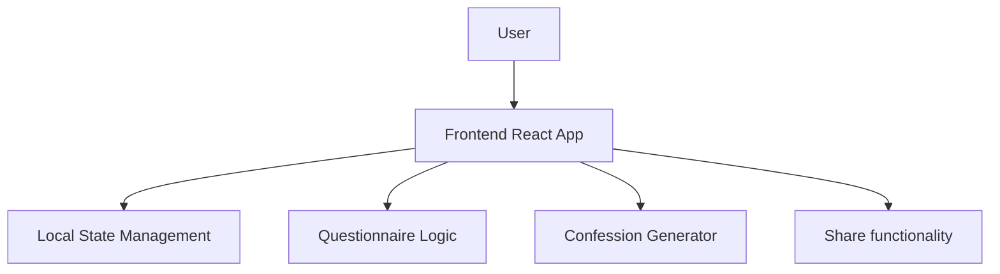

## 1. Architecture Design


## 2. Technology Description
- Frontend: React@18 + tailwindcss@3 + vite
- Initialization Tool: vite-init
- Backend: None (pure frontend application)
- Database: None (local state only)

## 3. Route Definitions
| Route | Purpose |
|-------|---------|
| / | Home page with hero section and start button |
| /questionnaire | Questionnaire page with personal info and preference questions |
| /result | Result page with generated confession message |

## 4. API Definitions
- No API required as this is a pure frontend application

## 5. Server Architecture Diagram
- No server architecture required as this is a pure frontend application

## 6. Data Model
### 6.1 Data Model Definition
```mermaid
flowchart TD
    A[UserInfo] --> B[PersonalInfo]
    A --> C[Preferences]
    A --> D[PartnerPreferences]
    A --> E[ConfessionResult]
    
    B --> B1[gender: string]
    B --> B2[name: string]
    
    C --> C1[personality: string[]]
    C --> C2[hobbies: string[]]
    C --> C3[loveLanguage: string]
    
    D --> D1[idealTraits: string[]]
    D --> D2[partnerInterests: string[]]
    D --> D3[relationshipGoals: string]
    
    E --> E1[confessionText: string]
    E --> E2[confessionType: string]
```

### 6.2 Data Definition Language
- No database required. All data will be stored in local state using React's useState and useContext hooks.